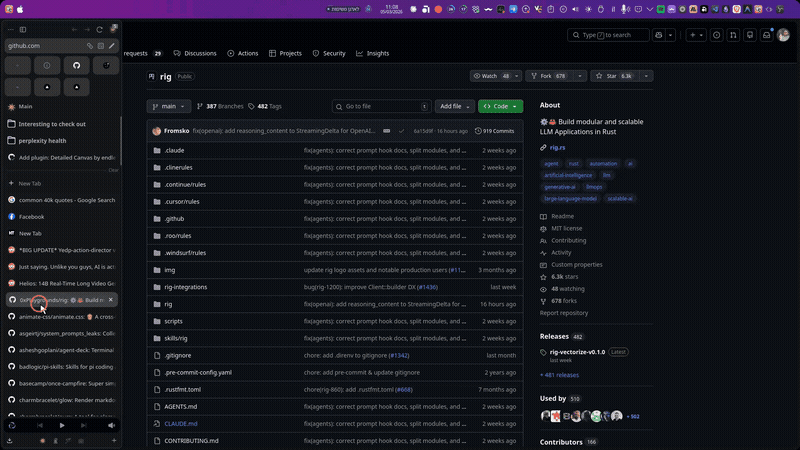

# Detailed Canvas


Enrich Obsidian Canvas link cards with AI-generated summaries, images, and metadata. Paste a URL, get a rich card — automatically.



## What It Does

When you add a link to an Obsidian Canvas, it shows as a plain URL card. Detailed Canvas transforms these into rich cards with:

- An **AI-generated summary** of the page content
- The page **title and description**
- A **cover image** extracted from the page
- For **tweets/X posts**: full tweet text, images, and author info

This works automatically when you paste a URL, or on-demand via right-click or command palette.

## Quick Start

1. **Install the plugin** via [BRAT](#via-brat-recommended-for-beta) or [Community Plugins](#via-community-plugins)
2. **Pick an AI provider** in Settings → Detailed Canvas — Ollama (free, local) or Groq (free cloud) are great starting points
3. **Paste a URL** onto any canvas — the plugin enriches it automatically

That's it. For detailed setup, keep reading.

## Installation

### Via BRAT (recommended for beta)

[BRAT](https://github.com/TfTHacker/obsidian42-brat) lets you install plugins that aren't yet in the community directory.

1. Install **BRAT** from Settings → Community Plugins → Browse → search "BRAT"
2. Enable BRAT
3. Open BRAT settings → click **Add Beta Plugin**
4. Enter: `endlessblink/detailed-canvas`
5. Click **Add Plugin**
6. Go to Settings → Community Plugins and enable **Detailed Canvas**

<details>
<summary><strong>Via Community Plugins</strong></summary>

> When available — the plugin may not be listed yet.

1. Open Settings → Community Plugins → Browse
2. Search for **Detailed Canvas**
3. Click Install, then Enable

</details>

<details>
<summary><strong>Manual Installation</strong></summary>

1. Download `main.js`, `manifest.json`, and `styles.css` from the [latest release](https://github.com/endlessblink/detailed-canvas/releases)
2. Create folder: `<your-vault>/.obsidian/plugins/detailed-canvas/`
3. Copy the three files into that folder
4. Restart Obsidian
5. Enable the plugin in Settings → Community Plugins

</details>

## Provider Setup Guides

Pick one provider. You can always switch later in settings.

| Provider | Cost | Best for |
|----------|------|----------|
| **[Ollama](#ollama-free-local)** | Free | Privacy, offline use, no account needed |
| **[Groq](#groq-free-cloud)** | Free | Fast results without local setup |
| **[OpenAI](#openai-paid)** | Paid | High-quality summaries with GPT models |
| **[Claude](#claude-paid)** | Paid | High-quality summaries with Anthropic models |
| **[OpenRouter](#openrouter-pay-per-use)** | Pay-per-use | Access to many models via one API key |

---

### Ollama (free, local)

Ollama runs AI models on your own computer. No API key, no cloud, no cost.

**In the plugin:** select **Ollama (local)** as provider → click **Test connection**. That's it — Ollama is the default provider and auto-detects at `http://localhost:11434`.

<details>
<summary><strong>Full Ollama setup walkthrough</strong></summary>

1. **Download and install** Ollama from [ollama.com](https://ollama.com/)
2. **Pull a model** — open a terminal and run:
   ```bash
   ollama pull llama3.2
   ```
3. **Verify it's running** — run `ollama list` to see your installed models
4. **Configure the plugin** — open Settings → Detailed Canvas:
   - Provider: **Ollama (local)** (this is the default)
   - Endpoint: `http://localhost:11434` (auto-filled)
   - Model: select from the dropdown (click **Refresh** if needed)
   - Click **Test connection** to verify

No API key is needed. Ollama runs at `http://localhost:11434` by default.

</details>

---

### Groq (free cloud)

Groq offers a free tier with generous limits — a great option if you don't want to run models locally.

**In the plugin:** select **Groq** as provider → paste your API key → click **Test connection**.

<details>
<summary><strong>Full Groq setup walkthrough</strong></summary>

1. **Sign up** at [console.groq.com](https://console.groq.com/) (free account)
2. **Create an API key** from the Groq dashboard
3. **Configure the plugin** — open Settings → Detailed Canvas:
   - Provider: **Groq**
   - API key: paste your key
   - Model: `llama-3.1-8b-instant` (default — fast and free)
   - Click **Test connection** to verify

**Free tier limits:** Groq's free tier includes rate limits on requests per minute and tokens per day. For typical canvas enrichment usage, the free tier is more than sufficient.

</details>

---

### OpenAI (paid)

Get an API key from [platform.openai.com](https://platform.openai.com/) → select **OpenAI** as provider → paste key → **Test connection**. Default model: `gpt-4o-mini`.

<details>
<summary><strong>Full OpenAI setup walkthrough</strong></summary>

1. Go to [platform.openai.com](https://platform.openai.com/) and create an account
2. Navigate to API Keys and create a new key
3. In Settings → Detailed Canvas:
   - Provider: **OpenAI**
   - API key: paste your key
   - Model: `gpt-4o-mini` (default, affordable)
   - Optionally set a custom base URL for compatible services
   - Click **Test connection**

</details>

---

### Claude (paid)

Get an API key from [console.anthropic.com](https://console.anthropic.com/) → select **Claude (Anthropic)** as provider → paste key → **Test connection**. Default model: `claude-haiku-4-5-20251001`.

<details>
<summary><strong>Full Claude setup walkthrough</strong></summary>

1. Go to [console.anthropic.com](https://console.anthropic.com/) and create an account
2. Navigate to API Keys and create a new key
3. In Settings → Detailed Canvas:
   - Provider: **Claude (Anthropic)**
   - API key: paste your key
   - Model: `claude-haiku-4-5-20251001` (default)
   - Click **Test connection**

</details>

---

### OpenRouter (pay-per-use)

OpenRouter gives you access to many models from different providers through a single API key.

Get an API key from [openrouter.ai](https://openrouter.ai/) → select **OpenRouter** as provider → paste key → **Test connection**. Default model: `openai/gpt-4o-mini`.

<details>
<summary><strong>Full OpenRouter setup walkthrough</strong></summary>

1. Go to [openrouter.ai](https://openrouter.ai/) and create an account
2. Create an API key from your dashboard
3. In Settings → Detailed Canvas:
   - Provider: **OpenRouter**
   - API key: paste your key
   - Model: `openai/gpt-4o-mini` (default)
   - Click **Test connection**

</details>

## Usage

There are three ways to enrich link cards:

**Right-click** a link card on your canvas → select **Enrich with AI description**

**Command palette** (`Ctrl/Cmd + P`) → search for:
- **Enrich selected link card** — process selected cards
- **Enrich all link cards in canvas** — batch-process every link card

**Auto-enrich on paste** — enabled by default. Paste a URL onto a canvas and it enriches automatically. Toggle this in settings.

## Settings Reference

| Setting | Default | Description |
|---------|---------|-------------|
| **AI Provider** | Ollama | Which AI service generates summaries |
| **Auto-enrich on paste** | On | Automatically process links when you paste URLs onto canvas |
| **Notes folder** | `Canvas Notes` | Folder where generated note files are stored |
| **Show notifications** | On | Display progress toasts during enrichment |
| **Max description length** | 500 | Character limit for AI-generated summaries |
| **AI prompt** | *"Summarize this web page content in 2-3 sentences..."* | Instructions sent to the AI — fully customizable |
| **Use environment variables** | Off | Read API keys from env vars instead of settings (`OPENAI_API_KEY`, `OPENROUTER_API_KEY`, `GROQ_API_KEY`, `ANTHROPIC_API_KEY`) |

## Troubleshooting

<details>
<summary><strong>"Connection failed" with Ollama</strong></summary>

Make sure Ollama is running. Open a terminal and run:
```bash
ollama serve
```
Then retry **Test connection** in plugin settings.

</details>

<details>
<summary><strong>"Invalid API Key" error</strong></summary>

Double-check your API key in Settings → Detailed Canvas. Make sure there are no extra spaces. If using environment variables, verify the variable is set in your shell.

</details>

<details>
<summary><strong>No models in the dropdown</strong></summary>

Click **Refresh** next to the model dropdown. If that doesn't work, click **Test connection** first to verify your provider is reachable.

</details>

<details>
<summary><strong>X/Twitter links show no content</strong></summary>

The plugin uses the fxtwitter API for tweet extraction. Make sure the URL is a tweet link (contains `/status/`). Profile or list URLs are not supported.

</details>

<details>
<summary><strong>Card not updating after enrichment</strong></summary>

Try the command palette method (`Ctrl/Cmd + P` → "Enrich selected link card") instead of auto-enrich. If the issue persists, check the developer console (`Ctrl/Cmd + Shift + I`) for errors.

</details>

<details>
<summary><strong>Ollama is slow</strong></summary>

Smaller models like `llama3.2` are faster. Larger models need more RAM and ideally a GPU. You can also try Groq for fast cloud-based inference at no cost.

</details>

<details>
<summary><strong>Plugin not appearing after install</strong></summary>

Restart Obsidian completely and check Settings → Community Plugins. If you installed via BRAT, make sure the plugin is enabled in both BRAT and Community Plugins.

</details>

## Development

```bash
npm install
npm run dev    # development with watch mode
npm run build  # production build
npm run lint   # lint the code
```

## License

MIT
